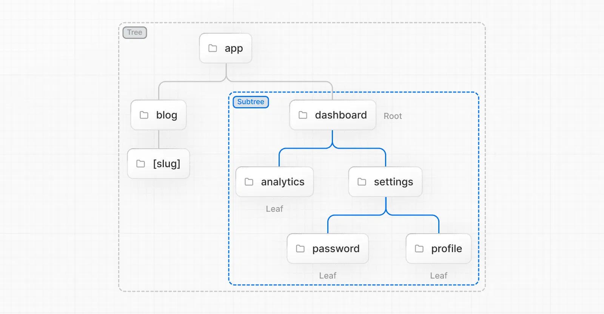

React 기반의 **프레임워크**인 Next.js에 대한 기초 내용을 정리한다.

## 🧐 왜 Next.js를 굳이 사용할까?
- **고품질** 웹 어플리케이션을 만들 수 있다!

1. **성능**: **SSR**(서버 사이드 렌더링)과 **SSG**(정적 사이트 생성)으로 초기 로드 시간 단축

2. **SEO**: SSR을 통해 미리 생성된 HTML이 제공되므로, 검색 엔진이 내부 컨텐츠를 쉽게 인덱싱 가능

3. **개발자 경험**: **자동 코드 분할**, **핫 리로딩**, **타입스크립트 지원** -> 생산성을 높임

4. **확장성**: **서버리스 함수**와 **데이터 페칭** 기능을 통해 유연한 확장성 제공

5. **유연성**: React와 완전히 호환되고, 다양한 툴 및 라이브러리와 함께 사용 가능

- **환경설정** 최소화: 웹개발에 필요한 대부분의 기능을 기본적으로 가지고 있음

- **강력한 기능** 제공: 
  - **렌더링 방식**(SSR, ISR, SSG)
  - **코드 스플리팅**: 페이지별로 **필요한 코드만 로드**
    
    **How?**: 각 컴포넌트를 **별도 JavaScript 번들로 분리**하여, 사용자가 특정 페이지에 방문할 때 필요한 부분만 로드하도록 보장
    
    React에서는 `Suspense`와 `lazy`를 이용해 구현해야 하지만, Next.js는 알아서 처리해줌
     
     ※ TTV(Time To View): 사용자가 최초 View를 볼 수 있을 때까지의 시간

- 쉬운 **서버 로직**: `API Route`와 `Server Action`으로 간단한 백엔드 구현 가능
  
  하지만 `WebSocket` 등 복잡한 로직이나 독립 배포 불가하다는 한계가 존재

- 간편한 **배포**: **Vercel**로 프론트엔드, 백엔드 통합 배포 가능

## ⚔️ 라이브러리 vs 프레임워크
**제어권**이 누구에게 있는지에 차이가 있다.
- **라이브러리(React)**:  **개발자가 제어**하며 필요한 기능을 호출
- **프레임워크(Next.js)**: **프레임워크가 제어**하며 개발자는 규칙에 맞춰 사용
  
ex) 라우팅 구현을 **React**에서는 `react-router-dom`을 통해 직접 제어, **Next.js**에서는 **파일 기반 라우팅 자동 제공**

Next.js는 React의 확장으로 **렌더링**, **라우팅**, **최적화** 등을 통합 제공한다.

## ✨ App Router와 Pages Router 차이
Next.js 개발의 시작점인 **라우터 선택**을 위해 상세 비교를 한다.

| 특성              | **Pages Router**                                         | **App Router**                                     |
| ----------------- | -------------------------------------------------------- | -------------------------------------------------- |
| **버전 지원**     | Next.js 12버전까지 사용되던 방식                         | Next.js 13버전부터 새롭게 도입된 방식              |
| **디렉토리 구조** | `pages/` 폴더에 페이지 위치시킴                          | `app/` 폴더에 하위 폴더명 기반으로 페이지 위치시킴 |
| **라우팅 방식**   | 파일 기반 (예: `pages/about.js` → `/about`)              | 폴더 기반 (예: `app/about/page.js` → `/about`)     |
| **동적 라우팅**   | `[param]` 파일 (예: `pages/posts/[id].js`)               | `[param]` 폴더 (예: `app/posts/[id]/page.js`)      |
| **레이아웃 관리** | 전역 설정 또는 페이지별 설정                             | `layout.js`로 폴더별 유연한 설정                   |
| **데이터 페칭**   | `getStaticProps`, `getServerSideProps`, `getStaticPaths` | React 18의 새로운 데이터 페칭 방식 지원            |
| **서버 컴포넌트** | 클라이언트 중심                                          | 서버 컴포넌트와 클라이언트 명시적 구분             |
| **사용 용이성**   | 간단하고 직관적                                          | 유연하지만 초기 학습 필요                          |
| **프로젝트 적용** | 기존 프로젝트에 적합                                     | 신규 프로젝트 및 최신 기능 활용에 적합             |

## 🛠️ Next.js 시작하기: React와 뭐가 다를까?
- **설치**:  
1. 터미널에서 다음 명령어 입력

    ```bash
    npx create-next-app@latest // 최신 버전
    npx create-next-app@14.2.18 // 14버전
    ```

2. 다음 설정 선택
   - TypeScript: Yes
  
   - ESLint: Yes
   - Tailwind CSS: Yes
   - `src/` 폴더: Yes
   - App Router: Yes(App Router 방식 사용)
   - Import alias: No

- **특징 살펴보기** 🔎:
  
1. `src/app/` 폴더: App Router 기반 라우팅의 시작
2. `layout.tsx`: 페이지의 **기본 틀**(헤더, 푸터 등) 정의
3. `page.tsx`: 실제 페이지 컨텐츠
4. `tailwind.config.ts`: 스타일링
5. `package.json`:
   - `npm run dev`: 개발 중 실행
   - `npm run build`: 배포용 빌드
   - `npm run start`: 빌드된 앱 실행

## 📂 파일(폴더) 기반 라우팅
**Tree 용어 정리**


- **Tree**: 계층 구조
- **Subtree**: tree 일부, **root**~**leaf**까지를 범위로 가짐
- **Root**: 최상위 노드
- **Leaf**: 자식이 없는 최하위 노드

**URL 용어 정리**


- **Domain**: 웹 사이트 주소를 나타내는 부분
  
  ex) https://www.example.com
  - **프로토콜**: `https` (통신 방식)
  - **서브도메인**: `www` (도메인의 하위 구분)
  - **SLD**: `example` (도메인의 소유자나 브랜드)
  - **TLD**: `.com` (웹사이트 목적이나 소속)
- **URL Segment**: `/`로 나뉜 경로
- **URL Path**: 사이트 내 특정 리소스 접근 경로

**정적 라우팅**

`page.tsx`를 통해 메인 ui가 표시, `폴더 구조`에 따라 라우팅이 자동 생성

ex) http://localhost:3000/a/b/c 경로로 접근했을 때 페이지를 표시하고 싶다면, page.tsx를 `src/app/a/b/c` 경로에 추가한다.

**동적 라우팅**

React에서는 `id`로 pathName을 넣어줬다면, Next에서는 폴더 이름을 **대괄호**로 감싼다. -> 동적 경로 생성

**라우트 그룹**

폴더가 항상 라우팅에 포함되지는 않고 **특정 그룹에만 적용**시키고 싶을 경우 `()`로 감싼다.

ex) 
- (admin)/about/page.tsx → /about
- (marketing)/business/page.tsx → /business

  → **URL에 ( )는 반영 안 됨!**

## 🛠️ 페이지 이동과 관련된 기능
- **a**: 순수 HTML 요소로, 페이지가 완전히 **새로고침**되고 빈 화면이 나타나 UX적으로 좋지 않다.

- **Link**: **a태그**의 확장
  - **prefatching** 지원: **뷰포트에 링크가 나타나는 순간 미리 로드**하여 빠른 전환을 만들어낸다.
  - **Client-Side Navigation**: html 페이지를 서버에서 다시 가져올 필요 없이, **필요한 JSON 데이터만 서버로부터 가져와** 클라이언트에서 페이지를 재구성하므로 새로고침이 발생하지 않는다.
  
- **useRouter**: **이벤트** 기반 이동

  ```tsx
  "use client";
  import { useRouter } from "next/navigation";
  export default function Test() {
    const router = useRouter();
    const handleClick = () => {
      router.push("/new_location");
    };
    return <button onClick={handleClick}>클릭</button>;
  }
  ```

  **Router 메서드**
  - `push`: 히스토리 추가(뒤로 가기 가능)
  - `replace`: 히스토리 대체(뒤로 가기 불가)
  - `back`: 뒤로 가기
  - `reload`: 새로고침

## 🛠️ 예약 파일들
1. `layout.tsx`
   - 역할: 특정 segment와 그 하위 경로에 공통 UI 적용
   - 특징: **chlidren prop** 필수, 리렌더링 없음
   - 구현: 특정 segement 이하의 route에서 적용받을 `layout.tsx` 파일을 해당 폴더 안에 만든다.

2. `template.tsx`
    - 역할: `layout`과 비슷하지만 이동 시 **리렌더링** 발생
    - 특징: 라우팅을 통해 탐색할 때, 매번 **새 인스턴스**를 생성 
    - 용도: 페이지 간 전환 시 **애니메이션**을 계속해서 주고 싶을 때, `useEffect`/`useState`에 의존하는 기능을 만들 때
    
    위와 같은 용도가 아니면 `layout.tsx` 사용 

3. `not-found.tsx`
    
    404 페이지 기본 제공

4. **metadata**
   
   ※ **SEO**: **검색 엔진 최적화**로 검색 엔진에서 **상위 노출**을 목표로 하는 방법, 예시로 `img` 태그의 `alt` 속성은 검색 엔진 인덱싱과 키워드 최적화, 접근성 향상에 도움이 된다.

     - Static Metadata: `layout.tsx`나 `page.tsx`에서 metadata를 export

        ```typescript
        export const metadata = {
          title: "My App",
          description: "Cool app",
        };
        ```

    - Dynamic Metadata: 특정 페이지 파일에서 `generateMetadata` 함수를 통해 동적 데이터를 반영

        ```typescript
        export function generateMetadata({ params }) {
          return { title: `Page ${params.id}` };
        }
        ```

## 🎨 Tailwind CSS
`craete-next-app`으로 함께 설치

https://tailwindcss.com/ 에서 원하는 디자인을 검색하여 className으로 삽입

